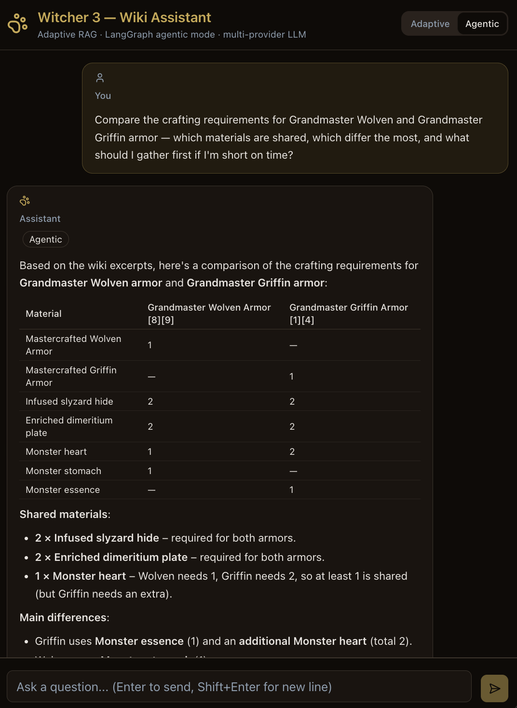

# 🐺 Witcher 3 - Wiki Assistant

**RAG-powered Q&A assistant for The Witcher 3: Wild Hunt.** Ask questions in natural language, get answers backed by the official wiki - with cited sources, retrieved chunks, and token tracking visible.

---

## 🖼️ Preview



---

## 🎥 Demo

**Adaptive mode** - fast, single-pass RAG:

https://github.com/user-attachments/assets/cab81459-455a-491a-9ca8-66a8b25bcc35

**Agentic mode** - multi-step LangGraph ReAct:

https://github.com/user-attachments/assets/caf0982d-e0fb-4207-a14f-7e0318b6dc11

---

## 🏗️ Architecture

```
docker compose up ───▶ 4 containers:

  frontend (:5173) ──▶ backend (:8000) ──▶ chromadb (:8000)
  Vite + React          FastAPI + LangChain    ChromaDB (Docker)
                              │                 + LangGraph (agentic)
                    ┌─────────┴──────────┐
                    ▼                    ▼
              Voyage API          DeepSeek API (default)
              (embeddings)        or Claude / GPT-4o / Ollama
              or Ollama nomic
```

### Retrieval modes

| Mode | Default | How it works |
|------|---------|--------------|
| **Adaptive** | yes | History-aware rewrite → retrieve → score-gated second rewrite/retrieve → generate |
| **Agentic** | UI toggle | Agent decides what to search next (up to a few rounds), gathers more sources, then answers from them |

Adaptive is the everyday path. Agentic is for multi-step / multi-aspect questions - toggle it in the chat header. Prefer DeepSeek / OpenAI / Claude for Agentic (tool-calling); local Ollama may struggle.

---

## 🚀 Quick Start

```bash
# 1. Clone & set up env
git clone <repo-url> && cd witcher-rag
cp backend/.env.example backend/.env   # add your DEEPSEEK_API_KEY

# 2. One command to rule them all
make setup

# 3. Open the app
open http://localhost:5173
```

**Prerequisites:** Docker, `make`. That's it - everything else runs in containers.

### Dev vs prod Compose

| | Dev (default) | Prod-like |
|---|---|---|
| File | `docker-compose.yml` | `docker-compose.prod.yml` |
| Start | `make setup` / `make up` | `make up-prod` |
| Frontend | Vite HMR on `:5173` | nginx static on `:8080` |
| Backend | `uvicorn --reload` + live `src` mount | `uvicorn` without reload |

```bash
make up-prod          # build & start prod stack
open http://localhost:8080
make down-prod
```


---

## 🧱 Stack

| Layer | Tech |
|-------|------|
| Frontend | Vite + React 18 + TypeScript + Tailwind CSS |
| Backend | FastAPI + LangChain + LangGraph |
| Vector DB | ChromaDB (Docker) |
| Embeddings | Voyage `voyage-4-lite` (default), or Ollama `nomic-embed-text` |
| LLM | DeepSeek (default), Claude & GPT-4o supported |
| Infra | Docker Compose, GitHub Actions |

---

## 📂 Project Structure

```
witcher-rag/
├── frontend/           # Vite + React + TypeScript + Tailwind
├── backend/            # FastAPI + LangChain + LangGraph
│   └── src/
│       ├── config.py       # Settings (env vars → typed config)
│       ├── models.py       # Pydantic models + TypedDicts
│       ├── llm.py          # LLM + vector store providers
│       ├── embeddings.py   # Voyage / Ollama embeddings
│       ├── prompts.py      # Prompt templates
│       ├── utils.py        # Format + token helpers
│       ├── rag.py          # Adaptive RAG pipeline
│       ├── agent_graph.py  # LangGraph agentic RAG
│       ├── api.py          # /api/chat + /api/health
│       └── ingest.py       # Wiki fetch → chunk → embed
├── data/raw/           # Raw wiki JSON (git-ignored)
├── tests/              # Eval dataset + integration tests
├── docker-compose.yml       # Dev stack (hot reload)
├── docker-compose.prod.yml  # Prod-like stack (nginx frontend)
├── Makefile
└── README.md
```

---

## ✨ Features

- 🔍 **RAG over Witcher 3 wiki** - natural language Q&A
- 🔀 **Dual retrieval modes** - Adaptive (default) and LangGraph Agentic toggle
- 📎 **Source citation** - every answer links back to wiki pages
- 📊 **Transparent retrieval** - chunks, agent steps (agentic), and token count per query
- 🐳 **Docker Compose** - one command to run everything
- 🤖 **Multi-provider LLM** - DeepSeek by default, swap to Claude or GPT-4o with one env var
